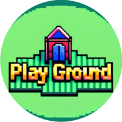

<p align="center">
	
</p>

<h1 align="center">Platformer Playground</h1>

<p align="center">
	<strong>Generate fun levels and play them!</strong>
</p>

## 🚀 Overview

Welcome to **Platformer Playground**! There is a python program which can be run to generate your own levels! The levels don't have to be made using the python program however. The game loads in levels using a bitmap file, so you can make your own levels using any image editor!

## 🎨 Features

- **Level Editor:** Create your own levels!
- **Customizable:** The speed of the different enemies can be adjusted using the [JSON file](./config.json).
- **Smooth Gameplay:** Enjoy a smooth gameplay experience!

## 🛠️ Installation

To get started with the program, follow the steps below:

1. **Clone the Repository**
```sh
git clone https://github.com/321BadgerCode/platformer_playground.git
cd ./platformer_playground/
```

2. **Compile the Program**
```sh
g++ ./main.cpp -o ./platformer_playground -lglfw -lGL -lGLEW -lSOIL
```

<details>

<summary>📦 Dependencies</summary>

- **OpenGL:** `sudo apt-get install libglu1-mesa-dev freeglut3-dev mesa-common-dev`
- **GLEW:** `sudo apt-get install libglew-dev`
- **SOIL:** `sudo apt-get install libsoil-dev`

</details>

## 📈 Usage

To use the program, there is only **one** step!

1. **Run the program**
```sh
./platformer_playground
```

## 🎮 Level Editor

To create your own levels, there is only **one** step!

1. **Open the Level Editor**
```sh
python ./level_editor.py
```

<details>

<summary>💻 Color Meanings</summary>

<div class="color">

|	Color			|	Meaning			|
|	:---:			|	:---:			|
|	Black			|	Empty			|
|	Blue			|	Player			|
|	Green			|	Checkpoint/finish line	|
|	Red			|	Enemy			|

</div>

<style>
.color {
	tr:nth-child(1) td:nth-child(1) { color: black; }
	tr:nth-child(2) td:nth-child(1) { color: blue; }
	tr:nth-child(3) td:nth-child(1) { color: green; }
	tr:nth-child(4) td:nth-child(1) { color: red; }
}
</style>

</details>

## 📸 Screenshots

<video width="100%" controls>
	<source src="./asset/game_ex.webm" type="video/webm">
</video>

<video width="100%" controls>
	<source src="./asset/level_editor_ex.webm" type="video/webm">
</video>

## 📜 License

[LICENSE](./LICENSE)